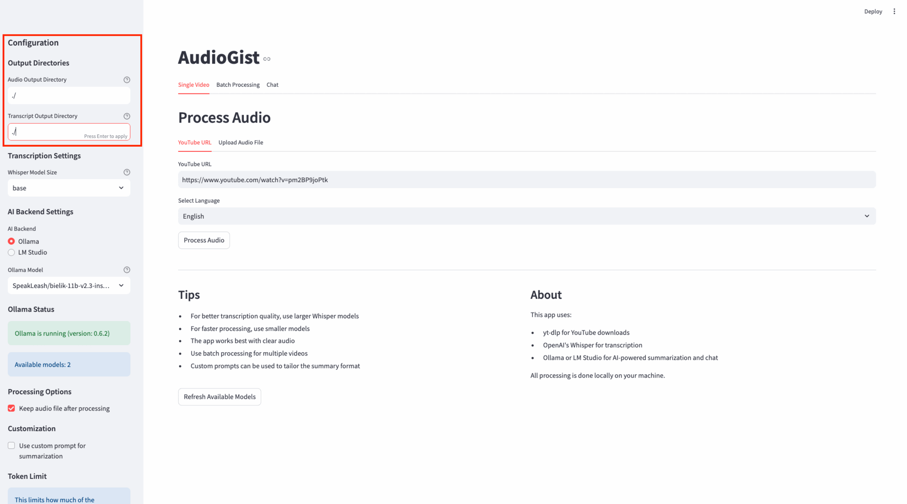

# AudioGist: Get the gist of audio content without the full listen

**AudioGist** is a powerful application that solves a critical time management problem: determining which long-form audio content deserves your attention without investing hours in listening.



AudioGist automatically processes YouTube videos and locally downloaded audio files to generate transcripts and AI-powered summaries, enabling users to:

- **Rapidly evaluate content relevance** before committing valuable time to full consumption
- **Extract key insights and talking points** from hours of audio content in minutes
- **Make informed decisions** about which podcasts, interviews, and lectures warrant complete attention
- **Reference and search** previously processed content through a convenient chat interface

## Key Differentiators

1. **Complete Privacy**: All processing occurs locally on the user's machine, ensuring sensitive content never leaves your system
2. **Flexible Input Options**: Process YouTube videos by URL or upload local audio files
3. **Enterprise-Grade AI**: Leverages OpenAI's Whisper for transcription and local LLMs for summarization
4. **Customizable Experience**: Adjustable token limits, custom prompts, and multi-language support
5. **Advanced RAG Processing**: Handles long transcripts through intelligent chunking and synthesis

## Features

- **Multiple Input Options**:
  - Download and process YouTube videos by URL
  - Upload and process local audio files
  - Batch process multiple YouTube videos

- **Advanced Transcription**:
  - Transcribe audio using OpenAI's Whisper (runs locally)
  - Support for multiple languages
  - Choose from different model sizes (tiny to large)
  - Automatic token count estimation

- **AI-Powered Summarization**:
  - Generate comprehensive summaries using local LLMs
  - Support for both Ollama and LM Studio backends
  - Provide overall summaries
  - Custom prompt templates

- **RAG Processing (with LMStudio)**:
  - Process long transcripts in chunks for better analysis
  - Provide both overall summaries and section-by-section insights
  - Customizable token/chunk sizes

- **Interactive Chat**:
  - Ask questions about the transcript
  - Get AI-generated answers based on relevant sections 
  - Persistent chat history
  - Synthesized responses from multiple transcript chunks (LMStudio only)

- **File Management**:
  - Save audio files, transcripts, and summaries
  - Customizable output directories
  - Download transcripts and summaries

- **Deployment Options**:
  - Run locally as a Python application
  - Deploy as a Docker container
  - Integrate with local or containerized AI backends

## Technical Implementation

The application runs on the user's local machine or in a Docker container, requiring minimal setup while providing maximum flexibility and privacy. It integrates with popular open-source AI tools ([Ollama](https://ollama.ai/) and [LM Studio](https://lmstudio.ai/)) to deliver high-quality summaries without subscription costs or API usage limits.

## Prerequisites

### For Local Installation

1. **Python 3.7+** with pip

2. **Required Python packages**:
```
streamlit>=1.22.0
yt-dlp>=2023.3.4
openai-whisper>=20230314
requests>=2.28.2
tiktoken>=0.3.3
PyPDF2>=3.0.0
python-docx>=0.8.11
numpy>=1.22.0
pandas>=1.5.0
```

3. **Local AI Backend** (at least one of):
- [Ollama](https://ollama.ai/) - for Linux/macOS
- [LM Studio](https://lmstudio.ai/) - for Windows/macOS

4. **FFmpeg** (for audio processing):
- [FFmpeg Installation Guide](https://ffmpeg.org/download.html)

### For Docker Installation

1. **Docker** and **Docker Compose**
2. **NVIDIA Container Toolkit** (optional, for GPU acceleration)
3. **FFmpeg** (included in the Docker image)

## Installation

### Local Installation

1. Clone this repository or download the source code:
```bash
git clone https://github.com/maciejjedrzejczyk/audiogist.git
cd audiogist
```

2. Install the required Python packages:
```bash
pip install -r requirements.txt
```

3. Make sure you have either [Ollama](https://ollama.ai/) or [LM Studio](https://lmstudio.ai/) installed and running locally.

### Docker Image Build and Start

1. Clone this repository:
```bash
git clone https://github.com/maciejjedrzejczyk/audiogist.git
cd audiogist
```

2. Build and start the containers:
```bash
docker-compose up -d
```

## Usage

### Starting the Application

#### Local Installation
```bash
streamlit run app.py
```

#### Docker Installation
After running `docker-compose up -d`, access the application at:
```
http://localhost:8501
```

### Processing a YouTube Video

1. Go to the "Single Video" tab
2. Select the "YouTube URL" tab
3. Paste a YouTube video URL
4. Select the language of the video
5. Click "Process Audio"
6. View and download the transcript and summary
7. Explore section-by-section summaries if available

### Processing a Local Audio File

1. Go to the "Single Video" tab
2. Select the "Upload Audio File" tab
3. Upload an audio file from your computer
4. Enter a title for the file (optional)
5. Select the language of the audio
6. Click "Process Audio"
7. View and download the transcript and summary

### Batch Processing

1. Go to the "Batch Processing" tab
2. Enter multiple YouTube URLs (one per line)
3. Select the language for all videos
4. Adjust the number of parallel downloads if needed
5. Click "Process All Videos"
6. View the results for each processed video

### Chatting with Transcripts

1. First process a video or audio file in the "Single Video" tab
2. Go to the "Chat" tab
3. Type your question about the transcript
4. View the AI-generated response that synthesizes information from relevant sections
5. Continue the conversation with follow-up questions

## Configuration

### Transcription Settings

- **Whisper Model Size**: Choose between tiny, base, small, medium, or large models
  - Larger models provide better accuracy but require more resources
  - The "base" model is a good balance for most use cases

### AI Backend Settings

- **Backend**: Choose between Ollama and LM Studio
- **Shorter content**: Ollama is recommended
- **Longer content requiring chunking and RAG**: LM Studio is recommended

### Customization

- **Custom Prompt**: Enable to customize the summarization prompt
  - Use {transcript} as a placeholder for the transcript content
  - Use {language} as a placeholder for the selected language

- **Token/Chunk Size**: Adjust how much of the transcript is processed at once
  - Controls both token limit for summarization and chunk size for RAG processing
  - Higher values process more text at once but may exceed model capabilities
  - 4000 tokens is a good default for most models

- **Chunk Overlap Percentage**: (LM Studio only) Adjust overlap between chunks
  - Higher values provide better context continuity between chunks
  - 10% is a good default value

## Docker Configuration

### Environment Variables

The Docker container supports the following environment variables:

- `OLLAMA_HOST`: URL for the Ollama API (default: http://ollama:11434)
- `LMSTUDIO_HOST`: URL for the LM Studio API (default: http://host.docker.internal:1234)
- `DOWNLOAD_DIR`: Directory for downloaded audio files (default: /app/downloads)
- `TRANSCRIPT_DIR`: Directory for saved transcripts (default: /app/transcripts)

## Troubleshooting

- **"Ollama is not running"**: Make sure Ollama is installed and running
  - For Docker: Check `docker-compose logs ollama`

- **"LM Studio is not running"**: Make sure LM Studio is running with the API server enabled
  - For Docker: Ensure the host machine's LM Studio is accessible to the container

- **Transcription errors**: Try using a smaller Whisper model or check your audio quality

- **Missing models**: Use the "Refresh Available Models" button to update the model list

- **Docker connectivity issues**:
  - Check network settings in docker-compose.yaml
  - Verify that services can communicate with each other
  - For LM Studio, ensure host.docker.internal resolves correctly

- **Performance issues**:
  - For better performance, use GPU acceleration
  - Adjust token/chunk size based on your model's capabilities
  - Consider using smaller models for faster processing

## Advanced Usage

### Customizing RAG Processing

When using LM Studio, the application leverages Retrieval-Augmented Generation (RAG) to:

1. Break long transcripts into manageable chunks
2. Process each chunk independently
3. Synthesize an overall summary
4. Use relevant chunks to answer specific questions

Adjust the token/chunk size and overlap percentage to optimize this process for your specific use case and models.

### Integrating with Other Tools

The Docker setup can be extended to integrate with other tools:

- Add a database container for persistent storage of transcripts and summaries
- Integrate with a web server for public hosting
- Connect to cloud storage for scalable file management
  
## Logging

AudioGist provides detailed debug logs to help you trace the end-to-end processing of audio, transcription, summarization, and chat. Logs include full transcripts, user questions, prompts sent to AI backends, API calls, and progress information.
  
- Logs are written to a file named `audiogist.log` in the current working directory by default.
- You can specify a custom log file path by setting the `AUDIOGIST_LOG` environment variable before starting the application.